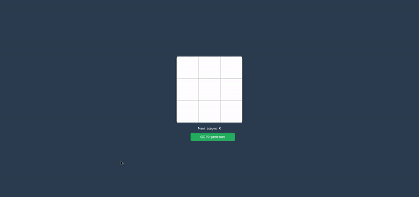

# 주제
  
<h4>리액트 학습을 위한 tic tac toe 게임입니다.</h4>

## UI

## 학습 내용
### 클래스형 컴포넌트 -> 함수형 컴포넌트
- 함수형 컴포넌트
    - 장점
        - 코드 간결
        - 성능이 클래스형 보다 더 빠름
            - 클래스형은 this(인스턴스 메소드 생성 및 관리 필요)를 사용 => 메모리 사용이 더많아짐
            - 함수형 : 코드 간결 => 컴파일 최적화 쉬움
        - 라이프사이클을 useEffect에서 한번에 관리(with Hooks)

 

### 컴포넌트 생성 및 데이터 전달
- state
    - 컴포넌트 내에서 뭔가를 기억해야 할 경우
    - 동적인 변화 처리
- props
    - "부모 => 자식"에게 데이터 전달
- 활용
    - 부모 쪽에서 state 관리
        - 자식들로 부터 데이터 모으기 용이함
        - 두 자식간 통신 가능
            props로 자식에게 state 전달만 해주면 됨

 

### 동작에 대한 기록 저장
- 게임 히스토리를 배열로 저장 => 특정 시점으로 돌아가는 이벤트를 발생시켜 과거로 이동

 

## 참고 강의
<a href="https://fastcampus.co.kr/dev_online_frontend">패스트 캠퍼스 - 프론트엔드 웹 개발의 모든 것 초격차 패키지</a>
